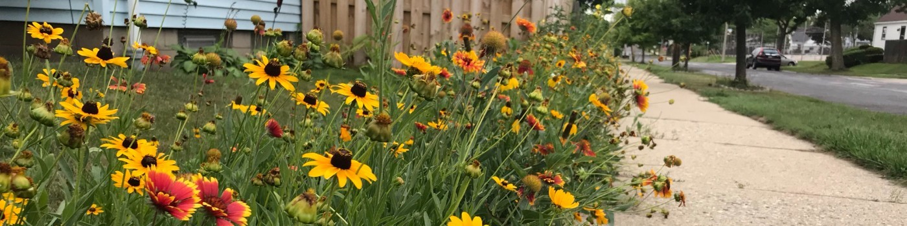

# I'm Lauren

- &#129472;&nbsp; .Midwest.Wisconsin.Milwaukee 
- &#129513;&nbsp; I like to solve problems and I’m interested in finding ways to build the ideas that are in my head.
- &#128214;&nbsp; Currently in a fullstack coding bootcamp (Aug 2021 - Feb 2022)
- &#9978; &#65039;&nbsp; When I'm not burning the candle at both ends (my current state), I can be found outdoor adventuring with my wife and dogs. Depending on the moment, that might mean camping, hiking, biking, rollerblading, etc. I also enjoy being at home, gardening and building stuff with wood.
- &#128269;&nbsp; Find me, here:
   * [LinkedIn](https://www.linkedin.com/in/legroh/ "LinkedIn Profile")
   * [CodePen](https://codepen.io/GrohTech "CodePen Profile")
   * [Twitter](https://twitter.com/GrohTech "Twitter Profile") 

## LIFE HIGHLIGHTS
1. Nannied in England
2. Taught English in China for a year
3. Hiked 1,800 miles of the Appalachian Trail
4. Relearned how to rollerblade

## TECHNOLOGIES I USE
* HTML
* CSS
* JavaScript
* Git

## CAREER UPDATES
### 2021 - Started University of Wisconsin Exdended Campus Coding Bootcamp
* Check out my repositories to see what I've been working on

### 2019 - Started working at University of Wisconsin-Milwaukee

Because of the experience with WordPress, I was tasked with (stay with me, as the responsibilities build):
  1. Mainting my department's WordPress website
  2. Creating and maintaining a new WordPress website for our division
  3. Doing a massive update on an existing static site, which is the portal to the maintenance management software used by everyone on campus:
     * Updated hundreds of files with a new style and a more concise message
     * Cleaned existing HTML/CSS files

### 2015 - Created my first WordPress Site
* No coding involved, but I learned about:
  * Wordpress
  * How to create a domain name
  * How to get your site hosted
  * How to move a site from one CMS to another

### 2012 - Graduated from college   
* UW-Milwaukee - Bachelor's degree in Journalism & Mass Communication

## MAINTAINERS OF MY LIFE
1. Lauren Groh (and often, my cats)
    * [LinkedIn](https://www.linkedin.com/in/legroh/ "LinkedIn Profile")
    * [CodePen](https://codepen.io/GrohTech "CodePen Profile")
    * [Twitter](https://twitter.com/GrohTech "Twitter Profile") 
